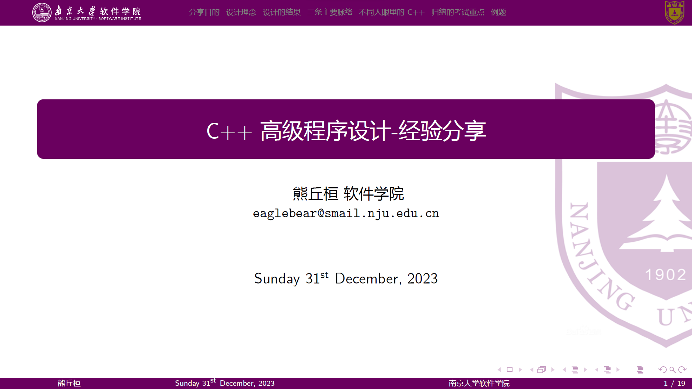

# NJUSE-Beamer

原模板：[YLiu1231/njumath_beamer: a beamer sample for njumather~ (github.com)](https://github.com/YLiu1231/njumath_beamer)

1. 将数学系的 logo 换成了南京大学软件学院的 logo；
2. 添加了 makefile，便于管理和编译 beamer 项目。
